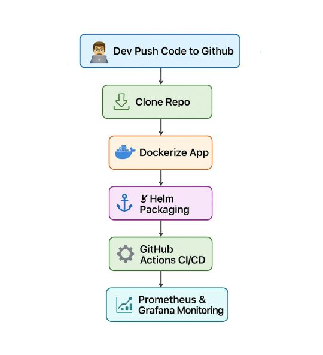

# **Bank CI/CD Site**

[](https://opensource.org/licenses/MIT)
[](https://www.docker.com/)
[](https://kubernetes.io/)
[](https://helm.sh/)
[](https://github.com/features/actions)
[](https://prometheus.io/)
[](https://grafana.com/)

## Overview
This project demonstrates a complete DevOps CI/CD pipeline for a static banking website built with HTML, CSS, and JavaScript. It simulates real-world DevOps challenges by automating the build, test, deployment, and monitoring processes. The pipeline ensures portability, scalability, reliability, and rapid iteration, key for modern web applications.

Key DevOps Problems Solved
Containerization (Docker): Solves environment inconsistencies and "works on my machine" issues by packaging the app into portable containers, enabling seamless deployment across dev, staging, and production.
Orchestration (Kubernetes): Addresses scalability and high availability by managing containerized apps in clusters, handling load balancing, auto-scaling, and fault tolerance for production workloads.
Packaging (Helm): Simplifies complex Kubernetes deployments, reducing manual errors and enabling version-controlled, reusable app configurations for faster rollouts.
Automation (GitHub Actions): Eliminates manual CI/CD bottlenecks, automating testing and deployment to catch bugs early, accelerate releases, and maintain code quality.
Monitoring (Prometheus & Grafana): Provides real-time insights into app performance and health, solving issues like downtime detection, alerting, and data-driven optimizations for reliability.
## Architecture
The pipeline follows these steps:

Clone Repo: Source code management via Git.
Dockerize App: Build and containerize the static site.
Kubernetes Deployment: Orchestrate containers in a cluster.
Helm Packaging: Manage and deploy via Helm charts.
GitHub Actions CI/CD: Automate builds, tests, and deployments.
Prometheus & Grafana Monitoring: Observe and visualize metrics.

## Architecture



## Tech Stack
Frontend: HTML, CSS, JavaScript, Bootstrap
Containerization: Docker
Orchestration: Kubernetes (with Kind for local testing)
Packaging: Helm
CI/CD: GitHub Actions
Monitoring: Prometheus, Grafana
Other: Jenkins (for alternative CI), ServiceMonitors for metrics

## Prerequisites
Docker (v20+)
kubectl (v1.20+)
Helm (v3+)
Kind (for local Kubernetes cluster)
Git

## Installation & Setup
Step 1: Clone the Repository

```bash
git clone https://github.com/Cloud-Architect-Emma/bank-cicd-site.git
cd bank-cicd-site
Step 2: Dockerize the App
Build and run the container locally:

```bash
docker build -t bank-site .
docker run -p 8080:80 bank-site
Visit http://localhost:8080 to view the site.
DevOps Benefit: Ensures consistent environments, solving deployment portability issues.
Step 3: Kubernetes Deployment
Set up a local cluster with Kind:

```bash
kind create cluster --name bank-cluster
kubectl apply -f k8s/
Port-forward to access: kubectl port-forward svc/bank-site 8080:80
DevOps Benefit: Manages scaling and resilience, addressing production workload challenges.
Step 4: Helm Packaging
Install via Helm:

```bash
helm install bank-site ./bank-site-chart
DevOps Benefit: Simplifies complex deployments, reducing errors in multi-environment setups.
Step 5: GitHub Actions CI/CD
Push to the main branch to trigger the workflow (see .github/workflows/).
It builds, tests, and deploys automatically.
DevOps Benefit: Automates repetitive tasks, speeding up releases and improving quality.
Step 6: Prometheus & Grafana Monitoring
Deploy monitoring stack:

```bash
kubectl apply -f prometheus-deployment.yaml
kubectl apply -f grafana-deployment.yaml
kubectl apply -f *-servicemonitor.yaml
Access Grafana at http://localhost:3000 (default: admin/admin).
DevOps Benefit: Provides observability, helping detect and resolve performance issues proactively.
```
## Usage
Local Development: Run Docker container and edit HTML/CSS/JS files.
CI/CD: Commit changes to trigger GitHub Actions for automated deployment.
Monitoring: Use Grafana dashboards to visualize metrics like CPU usage and request rates.

## Contributing
Fork the repo.
Create a feature branch: git checkout -b feature/new-feature.
Commit changes and push.
Open a Pull Request.
## License
This project is licensed under the MIT License - see the LICENSE file for details.

For issues or questions, open a GitHub Issue. Star the repo if you find it helpful!

